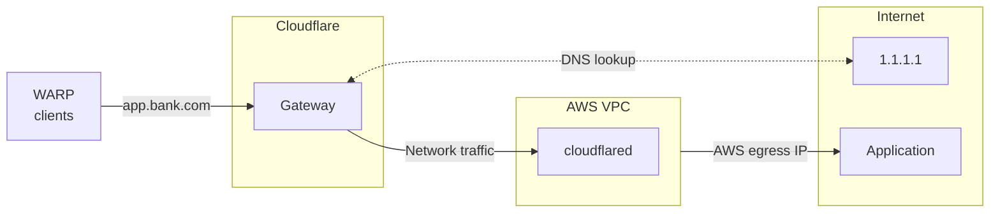

import { Render, Details } from "~/components";

<Render file="gateway/egress-selector-warp-version" />

Cloudflare Tunnel can be used for source IP anchoring when you want to use existing egress IPs instead of purchasing [Cloudflare dedicated egress IPs](/cloudflare-one/policies/gateway/egress-policies/dedicated-egress-ips/). Some third-party websites may have an Access Control List (ACL) that only allow connections from certain source IPs. If you already a non-Cloudflare IP on their allowlist (such an egress IP provided by an ISP or a cloud provider like AWS), you can configure `cloudflared` to anchor user traffic to the same IPs that you use today.

For example, assume that your organization's banking service, `app.bank.com`, expects user traffic to come from an AWS IP. You can install `cloudflared` in your AWS environment and add a public hostname route pointing to `app.bank.com`. When users connect to `app.bank.com` using the WARP client, Gateway will apply your network policies and route the filtered traffic down the corresponding Cloudflare Tunnel to AWS. The traffic can then egress to the public Internet using your AWS egress IP.

To learn more about how Gateway applies hostname-based policies, refer to the [Cloudflare blog]().

## Prerequisites

- [Connect your private network](/cloudflare-one/connections/connect-networks/private-net/cloudflared/connect-cidr/) to Cloudflare using `cloudflared`. In the AWS example shown above, you would connect the private CIDR block of your AWS VPC.
- User traffic is on-ramped to Gateway using one of the following methods:

	<Render file="gateway/egress-selector-onramps" />

## 1. Add a public hostname route

To route a public hostname through Cloudflare Tunnel:

1. In [Zero Trust](https://one.dash.cloudflare.com), go to **Networks** > **Routes** > **Hostname routes**.

2. Select **Create hostname route**.

3. In **Hostname**, enter the public hostname that represents the application (for example, `app.bank.com`). The hostname should be accessible from the public Internet.

4. For **Tunnel**, select the Cloudflare Tunnel that is being used to connect the private network to Cloudflare.

5. Select **Create route**.

## 2. Route network traffic through WARP

If your traffic is onboarded using WARP, ensure that traffic to the following IP addresses route through the WARP tunnel to Gateway:

- Initial resolved IP CGNAT range: `100.80.0.0/16`
- Private network CIDR block

### Route initial resolved IPs

When users connect to a public hostname route, Gateway will assign an initial resolved IP from the `100.80.0.0/16` range to the DNS query. The initial resolved IP mechanism is required because Gateway's network engine operates at L3/L4 and can only see IPs (not hostnames) when processing the connection. If the packet's destination IP falls within the designated CGNAT range, Gateway will know that it corresponds to a hostname route and sends it down Cloudflare Tunnel.

To route `100.80.0.0/16` through WARP:

<Render file="gateway/egress-selector-split-tunnels" />

### Route private network IPs

To route your private network's CIDR block through WARP, refer to [Connect a private network](/cloudflare-one/connections/connect-networks/private-net/cloudflared/connect-cidr/#3-route-private-network-ips-through-warp).

## 3. Create an egress policy

Create an egress policy that points traffic to Cloudflare Tunnel.

Traffic to the public hostname will now route to your private network before egressing to the Internet.